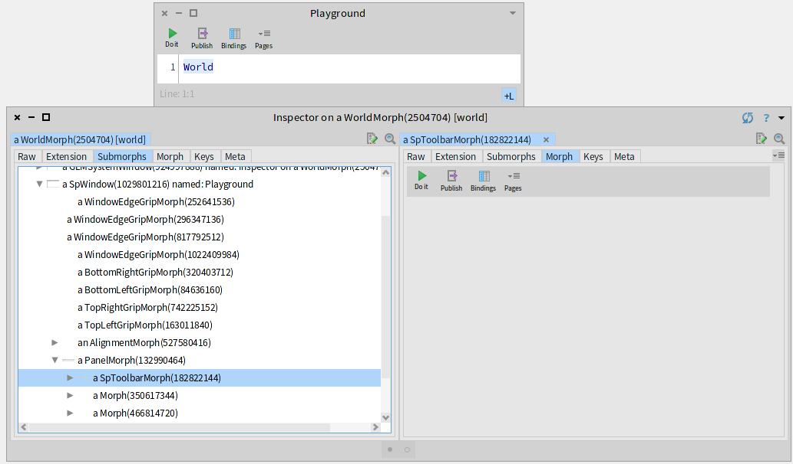
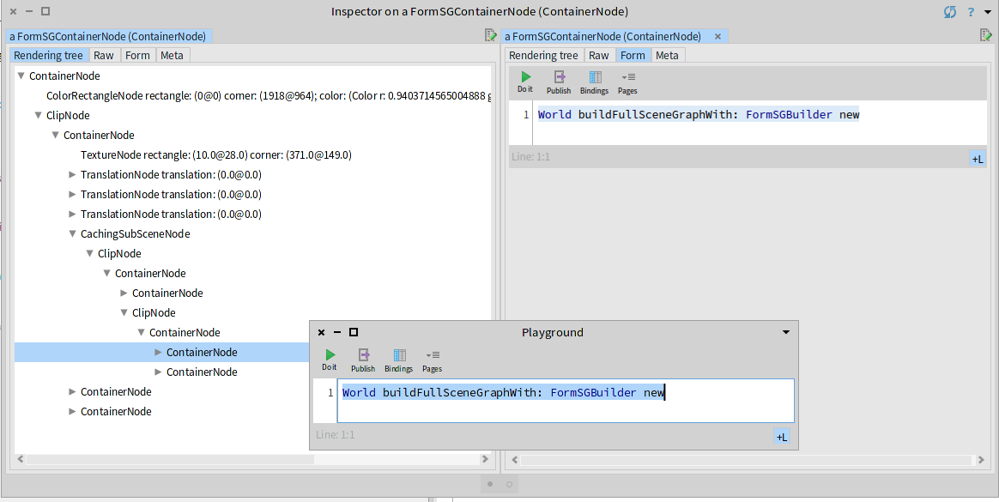

# A new scene graph based UI rendering framework
## Motivation
The design and implementation underlying Morphic, the UI framework used by Pharo, is dated and has several problems. Some of these problems related to the way that Morphic draws its UI are the followings:
- Direct usage of software based BitBlt primitives.
- Global coordinates are used everywhere.
- The UI rendering is not easy to scale to support Hi-Dpi rendering where a fractional scale factor may be needed (e.g: 96 dpi vs 120 dpi on Windows).
- BitBlt canvas rendering commands are hard-coded in the implementations of all morphs. This makes difficult adding different rendering backends.
- BitBlt canvas API is excessively large.
- Integrating Morphic in other GUI frameworks such as GTK may be expensive due to excessive copy of pixels.

For these reasons, we are proposing the implementation of a scene graph based rendering framework, based on the Gtk Scene Graph design, to solve the following problems:
- Remove the strict dependency on software BitBlt canvas based rendering in Morphic.
- Facilitate the integration of Morphic in GTK 3 and 4.
- Support multiple rendering backends by reducing the required API surface.

## Our current implementation
### The Morphic World UI tree
The UI in Morphic is defined in a hierarchical way. At the top level we have the WorldMorph which represents the whole content of a Pharo window. The world for the main Pharo window is associated to the *World* global variable. Each morph contains a list of submorphs which are drawn after the parent morph. The whole world morph UI tree can be inspected and explored by just opening a Playground and inspecting the value of the *Word*:



### How morphs are currently drawn
The current version of Morphic (at least until Pharo 9) is rendered by using the canvas metaphor implemented through software base BitBlt methods. The *Morph>>fullDrawOn:9* method is the single entry point for completely drawing a morph and recursively drawing its content. As an example, the following script can be inspected in a Playground to draw the content of the whole world in a Form:

```smalltalk
form := Form extent: 1024@1024 depth: 32.
World fullDrawOn: form getCanvas.
form
```

The full implementation of the full draw on method is the following one:

```smalltalk
Morph >> fullDrawOn: aCanvas
	"Draw the full Morphic structure on the given Canvas"

	self visible ifFalse: [^ self].
	(aCanvas isVisible: self fullBounds) ifFalse:[^self].

	(self hasProperty: #errorOnDraw) ifTrue:[^self drawErrorOn: aCanvas].

	[
		"Note: At some point we should generalize this into some sort of
		multi-canvas so that we can cross-optimize some drawing operations."
		"Pass 1: Draw eventual drop-shadow"
		self hasDropShadow ifTrue: [ self drawDropShadowOn: aCanvas ].

		"Pass 2: Draw receiver itself"

		aCanvas roundCornersOf: self during:[
			(aCanvas isVisible: self bounds) ifTrue:[aCanvas drawMorph: self].
			self drawSubmorphsOn: aCanvas.
			self drawDropHighlightOn: aCanvas.
			self drawMouseDownHighlightOn: aCanvas]

	] on: Error do: [:err |
		self setProperty: #errorOnDraw toValue: true.
		self setProperty: #drawError toValue: err freeze.
		^ self drawErrorOn: aCanvas
	]
```

That method can be decomposed in two important segments:
- Error handling during the drawing process. If an error is caught, turn the Morph into a red screen of death which is drawn with the *drawErrorOn:* method.
- Draw the content of the morph itself on the canvas. This process is composed of the following stages:
    - The *drawMorph:* method in the canvas performs a double dispatch that typically ends calling the *drawOn:* method.
    - Draw the submorphs with the *drawSubmorphsOn:* method.
    - Draw additional decorations in the morph.

The following is the default implementation for the *drawOn:*:
```smalltalk
Morph >> drawOn: aCanvas
	aCanvas fillRectangle: self bounds fillStyle: self fillStyle borderStyle: self borderStyle
```

As for the *drawSubmorphsOn:* the default implementation invokes the *fullDrawOn:* for each submorph with optional support for clipping it to the bounds of its parent:

```smalltalk
Morph >> drawSubmorphsOn: aCanvas
	"Display submorphs back to front"

	| drawBlock |
	submorphs isEmpty ifTrue: [^self].
	drawBlock := [:canvas | submorphs reverseDo: [:m | canvas fullDrawMorph: m]].
	self clipSubmorphs
		ifTrue: [aCanvas clipBy: (aCanvas clipRect intersect: self clippingBounds ifNone: [ ^ self ]) during: drawBlock]
		ifFalse: [drawBlock value: aCanvas]
```

## The design and implementation of a scene graph based renderer
One alternative mechanism to the immediate hierarchical drawing traversal described in the previous section is to instead build an intermediate hierarchical structure that only describes how the different elements are drawn. This rendering tree data structure is called a *scene graph*, and they are ubiquitous in the domain of 3D graphics rendering. Qt is a widely used 2D UI toolkit that also uses a scene graph for its rendering, and Gtk 4 is moving in favor of adopting this approach for performance reasons. Since one of our motivations is to facilitate integrating Morphic in Gtk, we decided to take as much inspiration as possible in the Gtk scene graph design so that we can have a smooth translation path for using it as an additional rendering backend.

### The Gtk Scene Graph (GSK) design
The Gtk Scene Graph design is based around nodes that represent only simple different rectangular shapes that are easy to render on the GPU. Complex UI widgets are implemented via composition of these different rectangular shapes. In the case of widgets that need to perform complex shape rendering, they can resort to use Cairo for drawing into a rectangular surface that is further composed as another rectangular shape node. The following C enum present in the Gtk 3.94 sources (gsk/gskenums.h) describes all of the different shapes that are supported by Gsk:

```c
/**
 * GskRenderNodeType:
 * @GSK_NOT_A_RENDER_NODE: Error type. No node will ever have this type.
 * @GSK_CONTAINER_NODE: A node containing a stack of children
 * @GSK_CAIRO_NODE: A node drawing a #cairo_surface_t
 * @GSK_COLOR_NODE: A node drawing a single color rectangle
 * @GSK_LINEAR_GRADIENT_NODE: A node drawing a linear gradient
 * @GSK_REPEATING_LINEAR_GRADIENT_NODE: A node drawing a repeating linear gradient
 * @GSK_BORDER_NODE: A node stroking a border around an area
 * @GSK_TEXTURE_NODE: A node drawing a #GdkTexture
 * @GSK_INSET_SHADOW_NODE: A node drawing an inset shadow
 * @GSK_OUTSET_SHADOW_NODE: A node drawing an outset shadow
 * @GSK_TRANSFORM_NODE: A node that renders its child after applying a matrix transform
 * @GSK_OPACITY_NODE: A node that changes the opacity of its child
 * @GSK_COLOR_MATRIX_NODE: A node that applies a color matrix to every pixel
 * @GSK_REPEAT_NODE: A node that repeats the child's contents
 * @GSK_CLIP_NODE: A node that clips its child to a rectangular area
 * @GSK_ROUNDED_CLIP_NODE: A node that clips its child to a rounded rectangle
 * @GSK_SHADOW_NODE: A node that draws a shadow below its child
 * @GSK_BLEND_NODE: A node that blends two children together
 * @GSK_CROSS_FADE_NODE: A node that cross-fades between two children
 * @GSK_TEXT_NODE: A node containing a glyph string
 * @GSK_BLUR_NODE: A node that applies a blur
 * @GSK_OFFSET_NODE: A node that renders its child after applying a 2D translation
 *
 * The type of a node determines what the node is rendering.
 **/
typedef enum {
  GSK_NOT_A_RENDER_NODE = 0,
  GSK_CONTAINER_NODE,
  GSK_CAIRO_NODE,
  GSK_COLOR_NODE,
  GSK_LINEAR_GRADIENT_NODE,
  GSK_REPEATING_LINEAR_GRADIENT_NODE,
  GSK_BORDER_NODE,
  GSK_TEXTURE_NODE,
  GSK_INSET_SHADOW_NODE,
  GSK_OUTSET_SHADOW_NODE,
  GSK_TRANSFORM_NODE,
  GSK_OPACITY_NODE,
  GSK_COLOR_MATRIX_NODE,
  GSK_REPEAT_NODE,
  GSK_CLIP_NODE,
  GSK_ROUNDED_CLIP_NODE,
  GSK_SHADOW_NODE,
  GSK_BLEND_NODE,
  GSK_CROSS_FADE_NODE,
  GSK_TEXT_NODE,
  GSK_BLUR_NODE,
  GSK_OFFSET_NODE,
  GSK_DEBUG_NODE
} GskRenderNodeType;
```

### The Form Scene Graph design and implementation
The Form Scene Graph is our approach for adding an intermediate scene graph to Morphic in particular, and to Pharo in general. Since a scene graph is by definition a tree data structure, the most important part on its design is the class hierarchy of its nodes. The Form Scene Graph node class hierarchy is the following:

- **FormSGNode**
	- **FormSGCachingSubSceneNode**: A container with a single child for explicit optimization.
	- **FormSGChildAttributeNode**: A single child container that modifies an attributes of its child.
		- **FormSGOpacityNode**: Opacity factor change (GSK_OPACITY_NODE)
		- **FormSGTransformNode**: Generic 2D transformation matrix (GSK_TRANSFORM_NODE)
		- **FormSGTranslationNode**: 2D translation (GSK_OFFSET_NODE)
	- FormSGClipNode: Clipping by a 2D rectangle (GSK_CLIP_NODE)
		- **FormSGRoundedClipNode**: Clipping by a 2D rounded rectangle (GSK_ROUNDED_CLIP_NODE)
	- **FormSGContainerNode**: A container of a list of nodes (GSK_CONTAINER_NODE).
	- **FormSGNullNode**: A node that draws nothing. This is a singleton and NullObject pattern.
	- **FormSGRectangleNode**: A node that actually draws a shape encompassed in a 2D rectangle.
		- **FormSGAthensNode**: A node that uses Cairo through Athens for drawing its content. (GSK_CAIRO_NODE)
		- **FormSGBorderNode**: A node that draws the border of a rectangle (GSK_BORDER_NODE).
		- **FormSGColorRectangleNode**: A node that draws a solid rectangle (GSK_COLOR_NODE).
		- **FormSGGradientNode** - A gradient between two colors.
			- **FormSGLinearGradientNode**: A linear gradient inside a rectangle. (GSK_LINEAR_GRADIENT_NODE)
				- **FormSGRepeatingLinearGradientNode**: A repeating linear gradient inside a rectangle. (GSK_REPEATING_LINEAR_GRADIENT_NODE)
			- **FormSGRadialGradientNode**: A radial gradient inside a rectangle. The radius can be clipped so it can be used for drawing circles and ovals.
		- **FormSGShadowNode**: A node for drawing a shadow casted by a rectangle.
			- **FormSGInsetShadowNode**: A shadow casted into the rectangle interior. (GSK_INSET_SHADOW_NODE)
			- **FormSGOutsetShadowNode**: A shadow casted into the rectangle exterior. (GSK_OUTSET_SHADOW_NODE)
		- **FormSGTextNode**: A node for drawing a colored text string. (GSK_TEXT_NODE)
		- **FormSGTextureNode**: A node for drawing textures (instances of the Form class). (GSK_TEXTURE_NODE)

Like any other tree hierarchy, the corresponding visitor interface for traversing the hierarchy is defined in the **FormSGVisitor** class. To reduce the complexity of building a rendering tree we provide the **FormSGBuilder** class. This builder also provides some facilities for optimizing out non-visible elements by keeping a stack of transformations and the current clipping rectangle. This tracking is required by some widgets such as the fast table which needs to know during rendering time its bounds. As another convenience for building a scene graph, the `FormSGNode>>#,` method is provided to facilitate composing nodes in a functional style.

### The implementation of rendering backends
Once a rendering tree is generated or obtained, the actual process of performing the actual rendering is performed by a rendering backend that is typically implemented as a visitor on the rendering tree. In our current implementation we provide the following three renderer backends:
- **FormSGAthensRenderer**: a renderer backend that uses Athens for the actual rendering.
- **FormSGCanvasRenderer**: this one uses the old BitBlt canvas for the actual rendering.
- **FormSGOSWindowGenericRenderer**: this is a renderer backend that uses the OSWindow generic renderer interface. The default implementation of this interface uses the SDL2 render API which may be implemented with a hardware accelerated API such as OpenGL.

Most of the process required for constructing a new rendering backend for the scene graph is on creating a new visitor for the rendering tree. The hardest node to implement is the text node (FormSGTextNode) due to the peculiarities of text rendering such as providing support for subpixel anti-aliasing, and implementing a proper mechanism for caching text glyphs in a texture atlas in the case of using a GPU based accelerated rendering API. These problems with text rendering are not present in the **FormSGAthensRenderer** and in the **FormSGCanvasRenderer**, but there are present in the **FormSGOSWindowGenericRenderer** backend.
SD: Can you explain why?

### Adapting Morphic to build the scene graph
Integrating the Form Scene Graph in Morphic is a two step process. In the first step, Morphic has to be extended with methods for building its corresponding scene graph. In the second step, a Morphic world renderer that builds the scene graph and draws it into the actual window surface has to be implemented. In terms of the extension for building the scene graph, in an analogous way to the `#fullDrawOn:` and `#drawOn:` methods we introduce the `#buildFullSceneGraphWith:` and`*#buildSceneGraphNodeWith:` methods to Morphic. These methods receive a scene graph builder as the argument. The source code for these methods is listed here:

```smalltalk
Morph >> buildFullSceneGraphWith: builder
	self visible ifFalse: [^ builder null].
	self fullBounds. "For layout computation"
	(self hasProperty: #errorOnDraw) ifTrue: [^ self buildDrawErrorSceneGraphNodeWith: builder ].

	^ [
		self doBuildFullSceneGraphWith: builder
	] on: Error do: [ :err |
		self setProperty: #errorOnDraw toValue: true.
		self setProperty: #drawError toValue: err freeze.
		self buildDrawErrorSceneGraphNodeWith: builder
	]
```

```smalltalk
Morph >> doBuildFullSceneGraphWith: builder
	| contentNode childrenNode overlayNode |
	contentNode := self buildSceneGraphNodeWith: builder.
	childrenNode := self buildChildrenSceneGraphNodeWith: builder.
	overlayNode := self buildOverlaySceneGraphNodeWith: builder.
	^ contentNode , childrenNode , overlayNode
```

```smalltalk
Morph >> buildSceneGraphNodeWith: builder
	^ builder fillRectangle: self bounds fillStyle: self fillStyle borderStyle: self borderStyle
```

The following script can be used for building and inspecting the whole rendering tree for the Morphic World in the main Pharo window:

```smalltalk
World buildFullSceneGraphWith: FormSGBuilder new
```



One important property of this rendering tree is that it is much easier to scale than Morphic because all of the nodes can be scaled. For applying an additional factor scale it is enough to wrap this generated tree in an additional `FormSGTransformNode`. This property facilitates supporting hi-dpi rendering without having to recompute all of the Morphic UI layouts which may be hard coded (e.g. border rectangle widths, toolbar height, etc.).

### Rendering the scene graph into the window surface
For replacing the rendering mechanism of the main morphic world it is required to implement a subclass of **AbstractWorldRenderer** and override the class side *#isApplicableFor:* and *priority* methods to enable it. We provide the *FormSGWorldRenderer* generic base implementation that uses the *FormSGOSWindowGenericRenderer* backend, and the *FormAthensSGWorldRenderer* class that uses the *FormSGAthensRenderer* backend. These world renderers take care of computing the scale factor required for hi-dpi support, building the actual rendering tree by delegating to their corresponding *WorldMorph*, and drawing the rendering tree directly into the window surface by delegating to a rendering backend.
