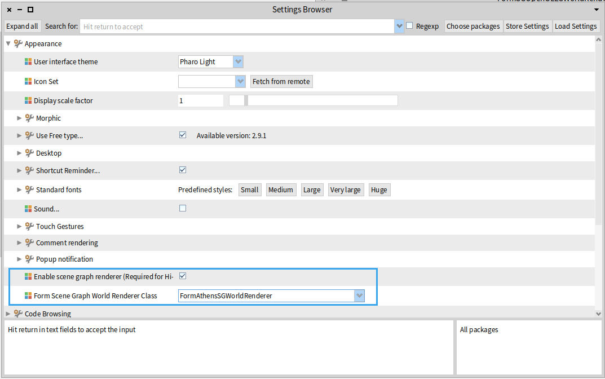

# Form Scene Graph
## Rendering framework inspired on GSK for Pharo.

### Loading the framework in Pharo

For loading this framework with the default software based backend, you need to
execute the following script in a playground:

```smalltalk
"Scene graph rendering framework"
Metacello new
   baseline: 'FormSceneGraph';
   repository: 'github://ronsaldo/form-scene-graph';
   load.
```

If you feel adventurous, and want to try the experiment OpenGL ES accelerated backend, you need
to load it with the following script in a playground, and then select it in the *Setting browser*:

```smalltalk
"Scene graph rendering framework"
Metacello new
   baseline: 'FormSceneGraph';
   repository: 'github://ronsaldo/form-scene-graph';
   load: #AcceleratedOpenGL.
```

### Enabling the new renderer on the main Pharo window.
For enabling this new renderer for the Pharo Morphic World, in addition to loading
this baseline it is required to also enable its usage through the *Settings browser*:



The effect of changing this setting is only visible after restarting the image by doing a save and quit.

### Extra: opening external windows (Very experimental)
```smalltalk
"Open an external world with the athens based scene graph renderer. (Most of the work goes here)"
FormSGAthensWorldMorph new open.

"Open an external world with the OpenGL ES based scene graph renderer. (Experimental, may be unstable)"
FormSGOpenGLESRendererWorldMorph new open.

"Open an external world with the SDL2 based renderer. (Several glitches and pending issues to fix)"
FormSGWorldMorph new open.

"Open an external world with the BitBlt based renderer. (Incomplete)"
FormSGCanvasWorldMorph new open.

```
